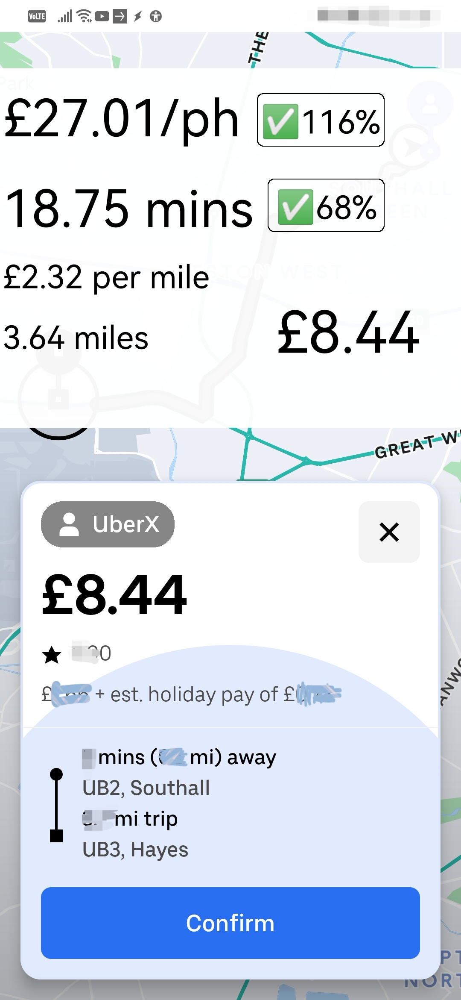

# Trip Rating for Ridesharing App

## Overview
This project aims to provide an accurate trip rating for ridesharing drivers. By leveraging Google Maps' modern routing capabilities, it offers real-time traffic conditions and precise journey estimates. 

This helps drivers make informed decisions about accepting or rejecting trips.
## Sample Preview
<p align="center">

</p>

## Features
- Accurate trip time and distance estimation using Google Maps API.
- Real-time traffic conditions considered in estimates.
- Detailed trip scoring based on distance, time, and potential earnings.
- Deployment on Cloudflare Workers using Hono (TypeScript).

## Deployment

### For Cloudflare Worker Deployment

### Using Hono (TypeScript)

### Using Google Maps Modern Routing for Computing Data

## Deploying - or Running as Dev

1. Clone the repository.
2. Set the `_my-app_` as the active directory in your terminal.
3. Install the dependencies:
   ```npm i```
4. Run the application in development mode:
```npm run dev```
5. To deploy, run:
```npm run deploy```
Cloudflare will prompt you to log in to deploy the worker.

## Problem Statement
Imagine you are given two outward codes (the first half of a postcodes) and need to decide, within 10 seconds, whether to accept a trip based on the amount you'll receive for traveling from one place to another. You have a map preview from uber but nothing from the bolt.

From this information, you need to make a guess about how long the trip will take and decide whether to accept or cancel it. Experienced drivers might be better at predicting trip times, but why rely on guesswork when you can have accurate estimates with traffic conditions taken into account?

## Limitations (TODO)
- The origin and destination are calculated with only outward codes (the first half of a postcodes).
- Trips with the same postcode from uber will use 5 min per mile staic value.
- Some trips might be poorly scored if they cross a single district as the api will center on the outward codes location, basically overestimate distance and time.
- A difference factor is currently in place to let the user know of the calcualted distance divided by the in app given distance.

## Implementation
Using Tasker on Android, the screen context is captured and sent as a POST request. The request tries to extract the origin and destination to perform a Google Maps API distance call. Based on the Google API response, the journey duration is sent back, and the trip is scored if needed. For example, it calculates how much the trip will translate to per hour.

## Future Implementation
More information about the destination trip, such as additional miles and time added to the current journey if the trip is accepted.\
Summary of the trip endpoint, providing an easier-to-understand format for drivers unfamiliar with different areas and locations.\
Cardinal directions from Central London, indicating whether the trip is outside London and the likelihood of returning with another trip.\
Historical area data capture to rate trips, indicating if the destination is a busy area at certain times.

## Reasons for This Project
As a former Uber and Bolt driver, I remember accepting all trips without knowing the specifics. Sometimes, I felt frustrated when stuck in traffic, with trips taking three times longer but only counting the miles for payment. This project aims to alleviate that frustration by providing accurate trip estimates and potential earnings.

## Reasons for Choosing the Technology
My first website was hosted on GitLab Pages, which doesn't support scripting and used a GitLab URL and domain. When I wanted to host something with a custom domain, Cloudflare was an option for domain management and free web page hosting. It also offers auto-deployment when connected to a Git repository.

Initially, Cloudflare Workers seemed too advanced for my knowledge. However, I discovered it supports WASM or JavaScript, and Hono's quickstart guide made it easy to set up. Deploying was as simple as running npm run deploy, with Cloudflare prompting for login credentials.

Google Maps API was chosen for its reliability and extensive capabilities, which I was familiar with from university. Combining this API with Android Tasker for making requests and displaying overlays with data from endpoint calls allows for effective trip estimation and scoring.

Conclusion
This project combines Cloudflare Workers, Hono, and Google Maps API to provide a robust solution for ridesharing drivers. By offering accurate trip estimates and scoring, it helps me and possibly some one else willing to try to  make informed decisions, enhancing their overall experience on the job. 
